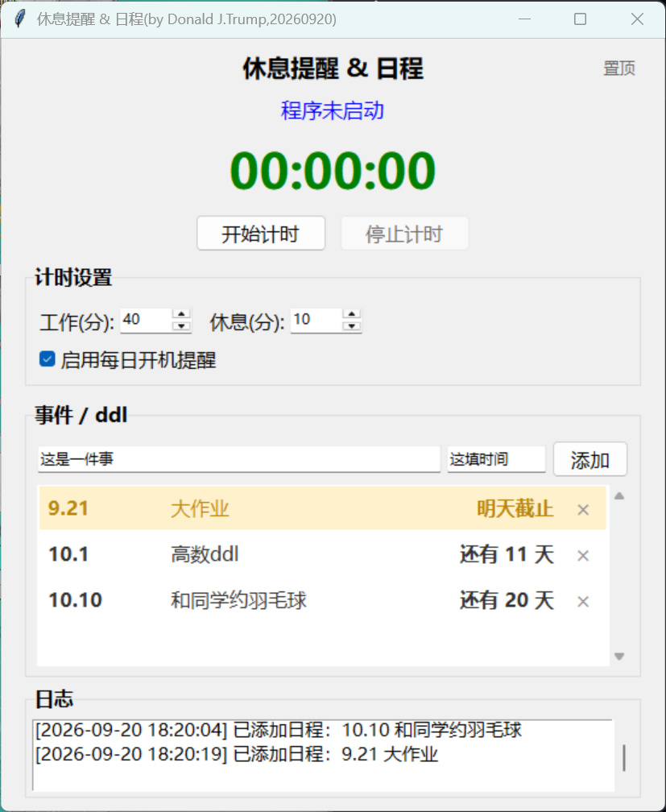

# Reminder

vibe coding就是爽）））

本程序适用于windows系统，暂未适配其他系统，所以可能会存在bug。核心代码为python程序，如果缺库的话需要自己补。

功能新改动：时间现在可以具体到时分秒了，并且也可以不写，可以用来装一些没有明确ddl但是确实想做的事情。新增了“重要”按钮，标为重要的事件会变为紫色

推荐额外搭配bat文件，并使用任务计划程序（taskschd.msc）进行开机自启动。

使用示例：

